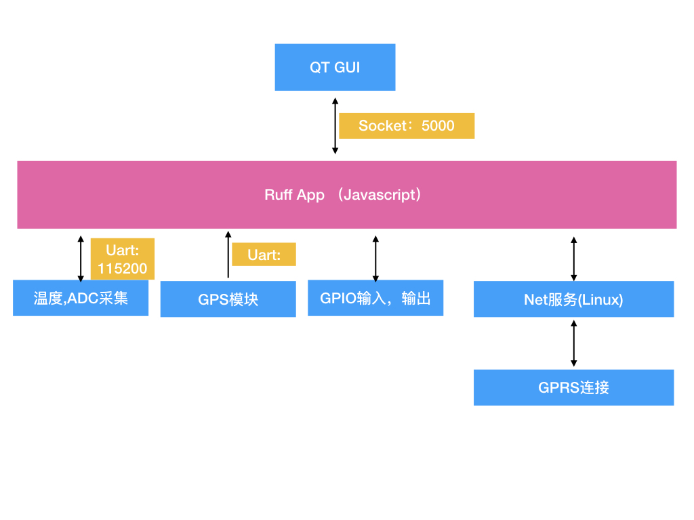

# 程序设计说明

程序用TypeScript语言，推荐使用VS Code 工具。运行在烤烟控制器之上。


## 模块构成

Ruff App实现了控制器的主要逻辑。



### 主程序
index.ts  -- 完成模块的初始化, 模块的运行，模块之间的调用;

### 运行逻辑
BakingProc.ts. -- 实现了运行逻辑，状态机切换，状态的保存

### 烘烤曲线的管理
BakingCurve.ts -- 运行曲线的类, 默认每隔10秒钟读取一次温度，仲裁控制行为。(风门的控制频率为60秒一次)

BakingElement.ts -- 烘烤段的基类

BakingSlope.ts -- 上升段，或下降段, 线性曲线
 
BakingSegment.ts  -- 恒温段

### 本地存储数据
保证在断电后，重启时，程序能恢复成断电前的状态。

LocalStorage.ts -- 

本地存储目录

~/baking/bakingStatus.json -- 本次烘烤的参数

~/baking/data/.   -- 温度数据的本地保存

~/baking/data/1/0.log -- 第一次烘烤的第一段的温度数据

~/baking/data/1/1.log -- 第一次烘烤的第二段的温度数据


### 外设的读取

ControlPheral.ts -- 输入高低电平读取，输出高低电平控制, 温度读取，ADC读取

所有外设参数读取的接口暴露

*.ts -- 其它的模块功能

### 烤烟控制算法

ControlAlgorithm.ts

### GPS经纬度读取

ControlGPS.ts

### 和QT程序通信

ControlQT.ts -- 用socket TCP 进行通讯， port: 5000

### ProtoBuf数据编解码
DecodeDB.ts --


### HTTPS API
HttpsApp.ts -- 提供了调用API

### MQTT
MqttApp.ts -- 

### 测试
JustTest.ts

test/test_amazont.ts. -- 测试和服务器的连接例程

test/test_protobuf.ts -- 测试protobuf的编码解码

### 读取机器sn号
utility.ts -- 还提供了多种打印格式函数

### 异步编程库

promise.js


```

├── ts
│   ├── Alarm.ts
│   ├── AppConfig.ts
│   ├── BakingCfg.ts
│   ├── BakingCurve.ts
│   ├── BakingElement.ts
│   ├── BakingProc.ts
│   ├── BakingSegment.ts
│   ├── BakingSlope.ts
│   ├── ControlAlgorithm.ts
│   ├── ControlGPRS.ts
│   ├── ControlGPS.ts
│   ├── ControlMcu.ts
│   ├── ControlPeripheral.ts
│   ├── ControlQT.ts
│   ├── DecodePB.ts
│   ├── HttpsApp.ts
│   ├── JustTest.ts
│   ├── LocalStorage.ts
│   ├── MqttApp.ts
│   ├── index.ts
│   ├── test
│   │   ├── indexgps.js
│   │   ├── test.ts
│   │   ├── test_amazon.ts
│   │   ├── test_https.ts
│   │   └── test_protobuf.ts
│   ├── utility.ts
│   └── yjasync.ts
```


## 烤烟控制逻辑-状态转移图


### 解释
烤烟控制器作为一个有限状态机，接受UI,和云端发来的指令，改变工作状态，完成对应的功能。

状态:

- 1 待机
- 2 暂停
- 3 运行
- 4 停止


## 程序运行

1. 读机器SN号
2. 读本地存储的文件，恢复上次烘烤状态，
	- 如是第一次运行恢复默认曲线
	- 
3. 设置告警门限参数
4. 初始化外设
	- 设置风机打开角度，风机打开速度
5. 延迟3秒
6. 初始化GPS通讯
7. 初始化烘烤主逻辑函数
	- 检查上棚／下棚
	- 初始化烘烤曲线
7. 建立和QT gui程序的通信
	- 初始化状态转移函数
8. 启动2.5秒一次的温度，电压查询任务
9. 初始化 https api 任务（未实现）
	- 获取 token
	- 检查版本
	- 获取mqtt username, code， url
10. 初始化 mqtt任务 （未实现）
	- 将mqtt的通讯嵌套到状态转移图，和烘烤逻辑 中去
	
